# Informe-9
# AMPLIFICADOR OPERACIONAL

## OBJETIVOS
Verificar el correcto funcionamiento de los amplificadores operacinales, en sus diferentes configuraciones, con el fin de poder rea;izar aplicaciones con estos dispositivos.

**Objetivos específicos:** 
- Verificar el principio de funcionamiento de un amplificador operacional.
- Analizar algunas aplicaciones básicas con el amplificador operacional.
- Familiarizarse con el uso de instrumentos de medida.

## MARCO TEÓRICO

“Es un dispositivo amplificador electrónico de alta ganancia acoplado en corriente continua que tiene dos entradas y una salida. En esta configuración, la salida del dispositivo es, generalmente, de cientos de miles de veces mayor que la diferencia de potencial entre sus entradas.”
Esta es la forma mas general a la que se le puede dar al amplificador, aunque, dependiendo de lo que se use, de forma muy simple se puede considerar como un comparador o seguidor de voltaje o tensión o, como su nombre dice, amplificador tanto inversor como no inversor, etc. Al 
menos en lo más básico. 

<section>
      

        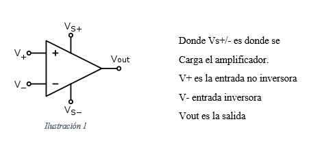           
   

   </section>

Para este dispositivo hay muchas formas, tamaño y usos; Además de que ya tiene mucho tiempo desde su invención hace ya más de medio siglo.
Existen varios tipos de amplificadores, el mas conocido es el 741.

<section>
      

        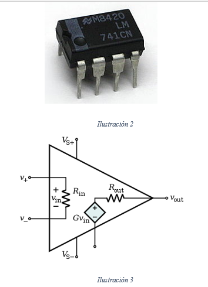           
   

   </section>
   

Dentro de los cálculos con transformadores, existe la particularidad de que se puede tomar como un ideal, donde Rin es infinita por lo tanto los voltajes de v+/- será 0, y eso seda porque esa resistencia suele ser de valores exageradamente grandes, y debido a eso también la Rout se convertirá en corto.
Estos dispositivos se mueven por medio de una contante, que se lama ganancia (AOL) tiene una relación de:
Vout=A_OL(V+-V-)
Hablando de forma ideal como comparador su ganancia es infinita, lo que hace es ver cual voltaje es el mas alto en las terminales v+/- si v+ es mayor entonces se cortocircuita Vs+ con la salida, caso contrario Vs- será el que hará corto.

En el circuito de un amplificador 741 se tiene un complejo sistema.

<section>
      

        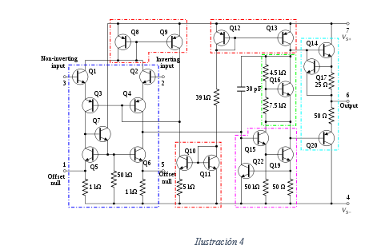           
   

   </section>

## **DESCRIPCIÓN DE LOS EQUIPOS Y MATERIALES**

**Generador de onda** 
<section>
      

                   
   

   </section>
   
**Multímetro digital**. Nos ayudara para poder hacer las mediciones de la practica
</section>
      

                   
   

   </section>

**Resistores** Los utilizaremos para crear el circuito que vamos a medir
</section>
      

                   
   

   </section>

**Protoboard.** Es la base en la cual se va a formar el circuito con los elementos de este.
</section>
      

                   
   

   </section>

**Osiloscopio.** 
</section>
      

                   
   

   </section>
   
   
   **Amplificadores Operacionales.**
   </section>
      

        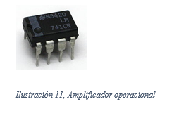           
   

   </section>
   
   
   
   
   
   
## **PROCEDIMIENTO**

- Construya en el protoboard cada uno de los circuitos de la figura 1. Muestre
simultáneamente las señales de entrada y salida en un osciloscopio. Dibuje o capture las formas
de onda.
- Determine y analice la relación entre las señales de entrada y salida en cada uno de los
circuitos indicados en la figura 1.
- Simule los circuitos y muestre resultados gráficos

</section>
      

                   
   

   </section> 

**8.4 Análisis de resultados**

**1.- Analice y compare las formas de onda obtenidas en la práctica con los resultados obtenidos
en el trabajo preparatorio. Comente dicha comparación.**

 </section>
      

        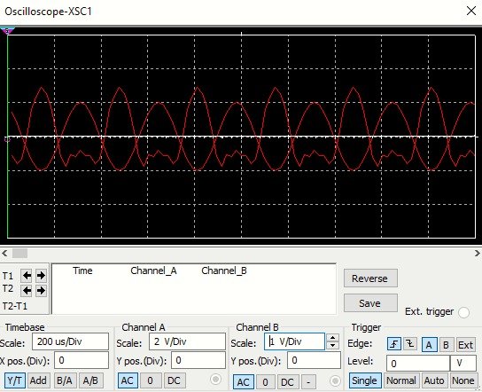           
   

   </section>    
   
   
Se ve claramente una diferencia entre la grafica que da la fuente por si sola que la que se da conectada desde la salida del amplificador, la del generador esta limpia, mientras que la del amplificador además de estar desfazada tiene movimiento en la parte mas inferior de la onda.

   
   
   </section>
      

        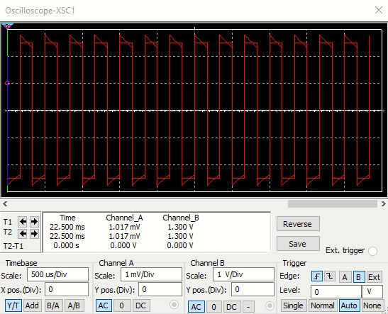           
   

   </section>   
      
   La diferencia es notoria en la parte mas externa de la de la gráfica, además de que la del amplificador es mil veces mas pequeña que la del generador, además que tener un pico que se va reduciendo con el tiempo, a diferencia del generador que el pico es simétrico.
     
   
   
   </section>
      

        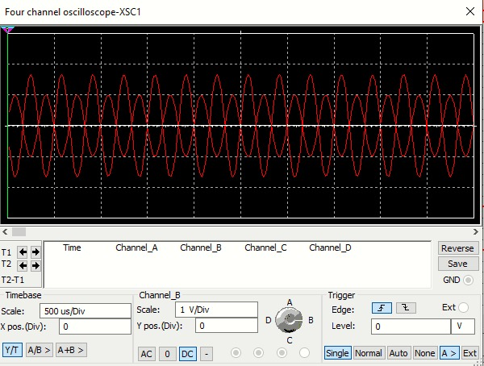           
   

   </section>    

En el tercer circuito solo se aprecian 2 ondas ya que los 2 generadores tienen el mismo valor por lo tanto se solapan, y tiene una muestra parecida al del primer circuito, ambas están limpias y hay desface entre ellas.

**8.5 Preguntas**

**1. Anote parámetros técnicos importantes de un amplificador operacional que deben ser
tomados en cuenta al momento de utilizarlos en un proyecto.**

Hablando de un amplificador real, debemos tener en cuenta la ganancia ya que esta no es infinita, el valor de la resistencia de entrada va con valores de millones en adelante, existe corriente de entrada.

**2. Investigue las características de amplificadores operacionales distintos a los utilizados en
esta práctica.**

Los que se utilizaron en los circuitos fueron UN amplificador inversor, integrador. Pero existen más tipos como un sumador inversor, cual suma los valores dentro de la entrada inversora, derivador ideal solo que este si se toma con alta frecuencia empieza a dar mucho ruido en la lectura y uno de los más útiles, el convertidor de digital a analógico, donde haciendo un circuito donde por medio de voltajes se den valores los cuales a través del amplificador dará un resultado analógico.
 Además, en otra clasificación hay los amplificadores de potencia y tensión.

**3. Investigue otras aplicaciones con circuitos más complejos que utilizan amplificadores
operacionales.**

Los usos son casi ilimitados, investigando se pueden llegar a dar muchos usos, lo que mas se suelen usar son: como es obvio para las calculadoras, como un conversor, regulador, filtro, búfer de audio y video, y para rectificar la precisión.

## **DIAGRAMAS**

</section>
      

        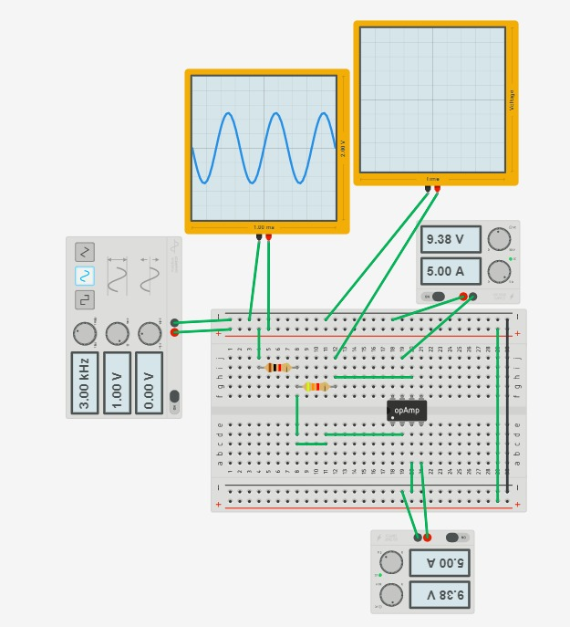           
   

   </section>
   
   
   </section>
      

        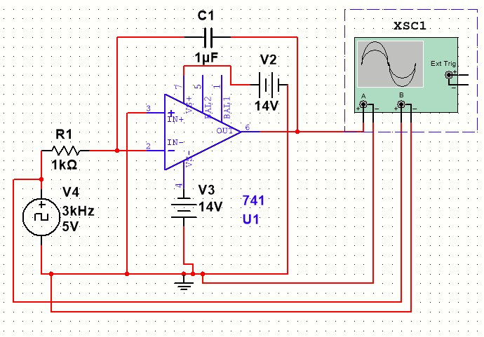           
   

   </section>

</section>
      

        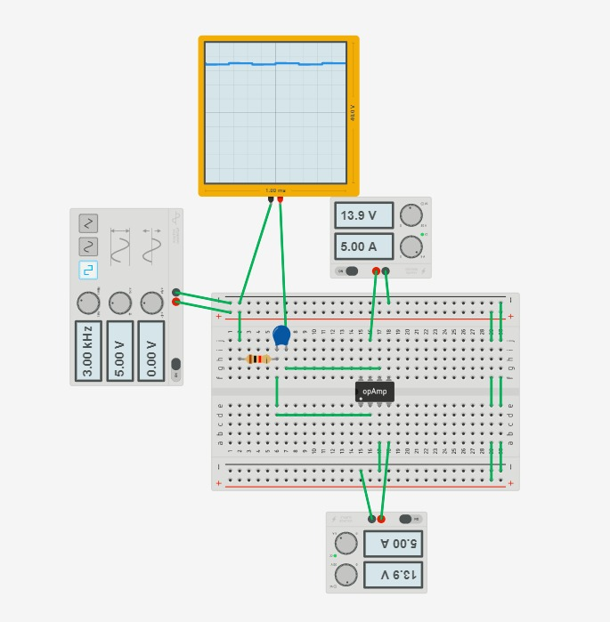           
   

   </section>
   
   
   
   </section>
      

        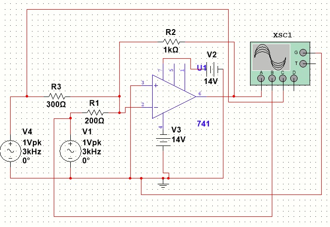           
   

   </section>
   
  </section>
      

        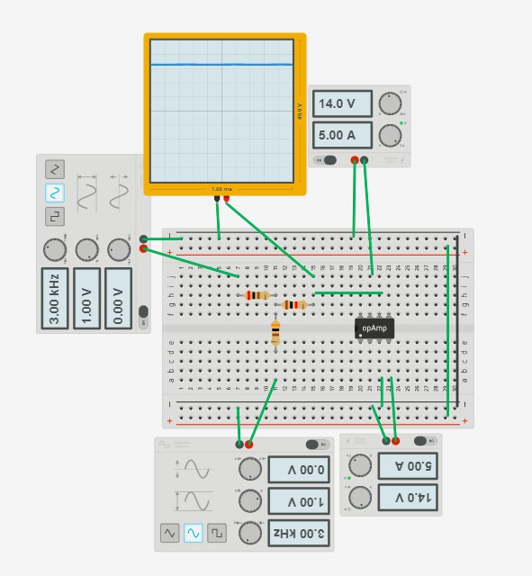           
   

   </section>                               
                                 
 
   </section>
      

        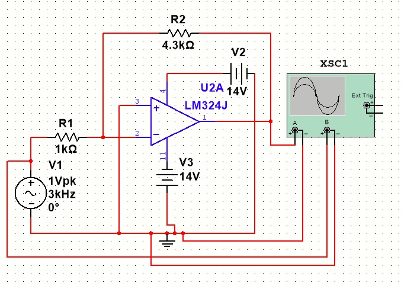           
   

   </section>    
   
   </section>
      

                   
   

   </section>    
   
   
   </section>
      

                   
   

   </section>    
   
   </section>
      

                   
   

   </section>    
   
   
   
   
   
   
   
   
   
                                  
   
## **LISTA DE COMPONENTES**

- Generador de señales
- Fuente DC.
- Osciloscopio.
- Protoboard
- Multímetro
- Cables conductores
- Resistencias, capacitores
- Amplificadores operacionales.

 </section>
      

        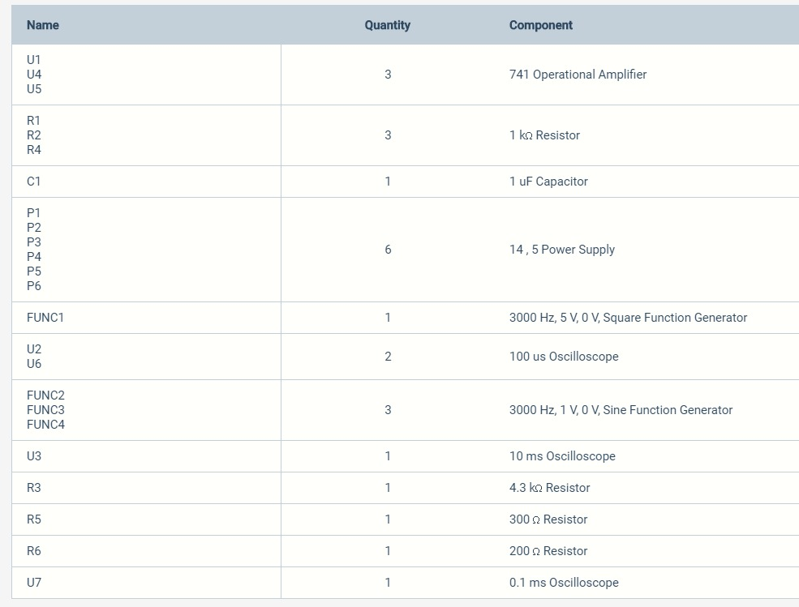           
   

   </section>

## **CONCLUSIONES**

Que un amplificador operacional es un dispositivo lineal de propósito general el cual tiene capacidad de manejo de señales normales o definidas por fabricantes. Que pueden ser manejadas por configuraciones básicas de un amplificador operacional. Y por medio de Operaciones lógicas básicas.

Dado que el amplificador operacional ideal reúne, entre sus características ideales, la de ganancia en lazo abierto (Av) e impedancia de entrada infinitas, la ganancia representada por la relación:
Av = vout/vin
Implica que la tensión vin tiende a cero, luego con una impedancia de entrada infinita, la corriente de entrada tiende a cero también, luego se dice que existe una tierra virtual para efectos de análisis donde la tensión es cero y la corriente también.

Hoy en día su utilidad es indispensable, ya que es utilizado para la fabricación de productos eléctricos. Ya sean electrodomésticos, computadoras, televisores, lavadoras. Por que se emplean también en cada una de ellas para su diseño, las operaciones básicas lógicas. Y que sin ellas no tendríamos el avance tecnológico que tenemos hoy en día y que seguiremos disfrutando.

Para esta práctica, se deseaba corroborar lo expuestoen teoría con la práctica, teniendo como resultado que si cumple, es decir, los circuitos básicos para amplificadoresoperacionales cumplen con los parámetros establecidosteóricamente, teniendo como consecuencia, un buenamplificador operacional.

## **RECOMENDACIONES**

Se establecen en función del proyecto y constituyen la base para un funcionamiento adecuado.

Conectar bien los aparatos de medición puede tener riesgo de electrocutarse.

## **CRONOGRAMA**

 </section>
      

                   
   

   </section>
  

  

# **BIBLIOGRÁFICA**

William H. Hayt, J., Kemmerly, J. E., & Durbin, S. M. (2012). Análisis de circuitos en ingenieria. Buffalo: Mc Graw Hill.
Vásquez, J. R. G. (s. f.). TEOREMAS FUNDAMENTALES DE CIRCUITOS ELÉCTRICOS. 251.

