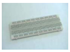

# Informe-9
# AMPLIFICADOR OPERACIONAL

## OBJETIVOS

Verificar el principio de funcionamiento de un amplificador operacional.

**Objetivos específicos:** 

- Analizar algunas aplicaciones básicas con el amplificador operacional.
- Familiarizarse con el uso de instrumentos de medida.

## MARCO TEÓRICO

“Es un dispositivo amplificador electrónico de alta ganancia acoplado en corriente continua que tiene dos entradas y una salida. En esta configuración, la salida del dispositivo es, generalmente, de cientos de miles de veces mayor que la diferencia de potencial entre sus entradas.”
Esta es la forma mas general a la que se le puede dar al amplificador, aunque, dependiendo de lo que se use, de forma muy simple se puede considerar como un comparador o seguidor de voltaje o tensión o, como su nombre dice, amplificador tanto inversor como no inversor, etc. Al 
menos en lo más básico. 

<section>
      

                   
   

   </section>

Para este dispositivo hay muchas formas, tamaño y usos; Además de que ya tiene mucho tiempo desde su invención hace ya más de medio siglo.
Existen varios tipos de amplificadores, el mas conocido es el 741.

<section>
      

                   
   

   </section>
   

Dentro de los cálculos con transformadores, existe la particularidad de que se puede tomar como un ideal, donde Rin es infinita por lo tanto los voltajes de v+/- será 0, y eso seda porque esa resistencia suele ser de valores exageradamente grandes, y debido a eso también la Rout se convertirá en corto.
Estos dispositivos se mueven por medio de una contante, que se lama ganancia (AOL) tiene una relación de:
Vout=A_OL(V+-V-)
Hablando de forma ideal como comparador su ganancia es infinita, lo que hace es ver cual voltaje es el mas alto en las terminales v+/- si v+ es mayor entonces se cortocircuita Vs+ con la salida, caso contrario Vs- será el que hará corto.

En el circuito de un amplificador 741 se tiene un complejo sistema.

<section>
      

                   
   

   </section>

## **DESCRIPCIÓN DE LOS EQUIPOS Y MATERIALES**

**Generador de onda** 
<section>
      

                   
   

   </section>
   
**Multímetro digital**. Nos ayudara para poder hacer las mediciones de la practica
</section>
      

                   
   

   </section>

**Resistores** Los utilizaremos para crear el circuito que vamos a medir
</section>
      

                   
   

   </section>

**Protoboard.** Es la base en la cual se va a formar el circuito con los elementos de este.
</section>
      

                   
   

   </section>

**Osiloscopio.** 
</section>
      

                   
   

   </section>
   
   
   **Amplificadores Operacionales.**
   </section>
      

                   
   

   </section>
   
   
   
   
   
   
## **PROCEDIMIENTO**

- Construya en el protoboard cada uno de los circuitos de la figura 1. Muestre
simultáneamente las señales de entrada y salida en un osciloscopio. Dibuje o capture las formas
de onda.
- Determine y analice la relación entre las señales de entrada y salida en cada uno de los
circuitos indicados en la figura 1.
- Simule los circuitos y muestre resultados gráficos

</section>
      

                   
   

   </section> 

**8.4 Análisis de resultados**

**1.- Analice y compare las formas de onda obtenidas en la práctica con los resultados obtenidos
en el trabajo preparatorio. Comente dicha comparación.**

**8.5 Preguntas**

**1. Anote parámetros técnicos importantes de un amplificador operacional que deben ser
tomados en cuenta al momento de utilizarlos en un proyecto.**

**2. Investigue las características de amplificadores operacionales distintos a los utilizados en
esta práctica.**

**3. Investigue otras aplicaciones con circuitos más complejos que utilizan amplificadores
operacionales.**

## **DIAGRAMAS**

</section>
      

                   
   

   </section>
   
   
   </section>
      

                   
   

   </section>

</section>
      

                   
   

   </section>
   
   
   
   </section>
      

                   
   

   </section>
   
  </section>
      

                   
   

   </section>                               
                                 
 
   </section>
      

                   
   

   </section>    
   
   </section>
      

                   
   

   </section>    
   
   
   </section>
      

                   
   

   </section>    
   
   </section>
      

                   
   

   </section>    
   
   
   
   
   
   
   
   
   
                                  
   
## **LISTA DE COMPONENTES**

- Generador de señales
- Fuente DC.
- Osciloscopio.
- Protoboard
- Multímetro
- Cables conductores
- Resistencias, capacitores
- Amplificadores operacionales.

 </section>
      

                   
   

   </section>

## **CONCLUSIONES**

En conclusion, se lograron los objetivos de la practica, los cuales eran, realizar un estudio del comportamiento de los circuitos electricos con corriente alterna, demostrando la onda senideal que este circuito genera, de las cuales logramos medir y calcular la amplitud, tension eficaz, periodo y la frecuencia de la onda, para el circuito realizado.

Con esta práctica se pudo adquirir los conocimientos teóricos de lo que son las ondas sinusoidal, de acuerdo al circuito montado.

Se pudo analizar la diferencia que existe entre un osciloscopio y un multímetro digital.

## **RECOMENDACIONES**

Se establecen en función del proyecto y constituyen la base para un funcionamiento adecuado.

Conectar bien los aparatos de medición puede tener riesgo de electrocutarse.

## **CRONOGRAMA**

 </section>
      

                   
   

   </section>
  

  

# **BIBLIOGRÁFICA**

William H. Hayt, J., Kemmerly, J. E., & Durbin, S. M. (2012). Análisis de circuitos en ingenieria. Buffalo: Mc Graw Hill.
Vásquez, J. R. G. (s. f.). TEOREMAS FUNDAMENTALES DE CIRCUITOS ELÉCTRICOS. 251.

