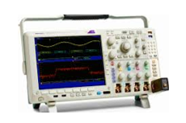

# Informe-9
# AMPLIFICADOR OPERACIONAL

## OBJETIVOS

Verificar el principio de funcionamiento de un amplificador operacional.

**Objetivos específicos:** 

- Analizar algunas aplicaciones básicas con el amplificador operacional.
- Familiarizarse con el uso de instrumentos de medida.

## MARCO TEÓRICO

## Capacitores y Bobinas.

Estos 2 elementos son capaces de almacenar una parte de la energía, además de que hay 2 formas de ver estos elementos en un circuito, de forma ideal y de forma real.

**Capacitores (Condensador)**

Es un elemento pasivo de un circuito, que tiene mayor utilidad dentro de un circuito AC ya que si se toma dentro de uno DC se convertirá en un circuito abierto, su medida son los faradios pero se puede transformar en reactancia para agilitar el cálculo con la fórmula: X_c=-1/jwF donde j es muestra de número complejo, w en rad/seg, F en faradios y se mide en ohmios , la característica del capacitor es que este se vuelve dependiente de la frecuencia del generador, entre mas Hz posea esta fuente el capacitor empezara ca comportarse como un cortocircuito, lo contrario a  cuando está en corriente DC. Mientras esta en el dominio del tiempo, su forma de calcular su intensidad es: i=F ∂v/∂t

<section>
      

                   
   

   </section>
   

**Bobinas (Inductor)**

“La suma de las corrientes que entran a un nodo (corriente total de entrada) es igual a la suma de las corrientes que salen de dicho nodo (corriente total de salida).” (Ricárdez, Bastién Montoya, Hernández, & H. S., 2017). Explica que la suma de todas las intensidades en un nodo especifico es igual a 0

Lo curioso entre las bobinas y los capacitores es que son polos opuestos totalmente lo contrario uno del otro, ergo, la bobina en corriente DC solo es un cortocircuito a diferencia que en AC donde con esta característica genera un campo electromagnético y empieza a generar una resistencia la corriente, su medida son los henrios, al igual que los capacitores se puede transformar a reactancia para mejor calculo con la fórmula :X_l=jwL donde j es muestra de numero complejo, w la frecuencia en rads/seg L en henrios, medido en ohmios. Además, si se mantiene en el dominio del tiempo, se puede calcular su voltaje de la siguiente forma: v=L ∂i/∂t

<section>
      

                   
   

   </section>

## **DESCRIPCIÓN DE LOS EQUIPOS Y MATERIALES**

**Generador de onda** 
<section>
      

                   
   

   </section>
   
**Multímetro digital**. Nos ayudara para poder hacer las mediciones de la practica
</section>
      

                   
   

   </section>

**Resistores** Los utilizaremos para crear el circuito que vamos a medir
</section>
      

                   
   

   </section>

**Protoboard.** Es la base en la cual se va a formar el circuito con los elementos de este.
</section>
      

                   
   

   </section>

**Osiloscopio.** 
</section>
      

                   
   

   </section>
   
## **PROCEDIMIENTO**

- Construya en el protoboard cada uno de los circuitos de la figura 1. Muestre
simultáneamente las señales de entrada y salida en un osciloscopio. Dibuje o capture las formas
de onda.
- Determine y analice la relación entre las señales de entrada y salida en cada uno de los
circuitos indicados en la figura 1.
- Simule los circuitos y muestre resultados gráficos

</section>
      

                   
   

   </section> 

**8.4 Análisis de resultados**

**1.- Analice y compare las formas de onda obtenidas en la práctica con los resultados obtenidos
en el trabajo preparatorio. Comente dicha comparación.**

**8.5 Preguntas**

**1. Anote parámetros técnicos importantes de un amplificador operacional que deben ser
tomados en cuenta al momento de utilizarlos en un proyecto.**

**2. Investigue las características de amplificadores operacionales distintos a los utilizados en
esta práctica.**

**3. Investigue otras aplicaciones con circuitos más complejos que utilizan amplificadores
operacionales.**

## **DIAGRAMAS**

</section>
      

                   
   

   </section>
   
   
   </section>
      

                   
   

   </section>

</section>
      

                   
   

   </section>
   
   
   
   </section>
      

                   
   

   </section>
   
  </section>
      

                   
   

   </section>                               
                                 
 
   </section>
      

                   
   

   </section>                                                               
                                  
   
## **LISTA DE COMPONENTES**

- Generador de señales
- Fuente DC.
- Osciloscopio.
- Protoboard
- Multímetro
- Cables conductores
- Resistencias, capacitores
- Amplificadores operacionales.

 </section>
      

                   
   

   </section>

## **CONCLUSIONES**

En conclusion, se lograron los objetivos de la practica, los cuales eran, realizar un estudio del comportamiento de los circuitos electricos con corriente alterna, demostrando la onda senideal que este circuito genera, de las cuales logramos medir y calcular la amplitud, tension eficaz, periodo y la frecuencia de la onda, para el circuito realizado.

Con esta práctica se pudo adquirir los conocimientos teóricos de lo que son las ondas sinusoidal, de acuerdo al circuito montado.

Se pudo analizar la diferencia que existe entre un osciloscopio y un multímetro digital.

## **RECOMENDACIONES**

Se establecen en función del proyecto y constituyen la base para un funcionamiento adecuado.

Conectar bien los aparatos de medición puede tener riesgo de electrocutarse.

## **CRONOGRAMA**

 </section>
      

                   
   

   </section>
  

  

# **BIBLIOGRÁFICA**

William H. Hayt, J., Kemmerly, J. E., & Durbin, S. M. (2012). Análisis de circuitos en ingenieria. Buffalo: Mc Graw Hill.
Vásquez, J. R. G. (s. f.). TEOREMAS FUNDAMENTALES DE CIRCUITOS ELÉCTRICOS. 251.

